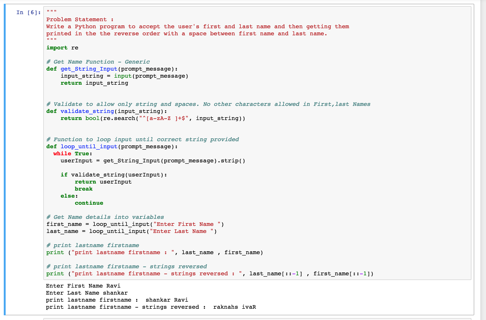
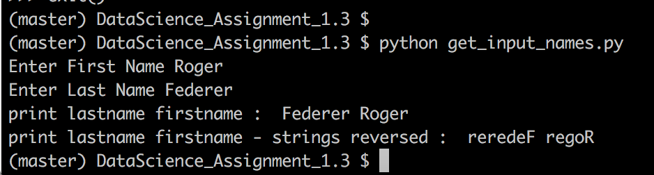

# Problem Statement :
```
Write a Python program to accept the user's first and last name and then getting them
printed in the the reverse order with a space between first name and last name.
```

## Snapshot - Run from jupyter REPL 
```
import get_input_names.ipynb in jupyter REPL 
```




## Snapshot - Run from command line bash
```
Command to execute : python get_input_names.py
```


